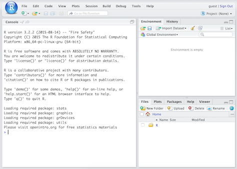

```{r setup, echo=FALSE}
knitr::opts_chunk$set(echo = TRUE)
```

# Welcome to R-Ladies RTP!

## Outline

- Introduction to R and RStudio
- Documenting your code
- Loading data
- Data manipulation with dplyr
- Basic R syntax
- Tidying up messy data with tidyr
- What next?
- Hands on exercises

## Materials

- All source code at https://github.com/rladies/rtp-data-manipulation-09-22-16

- Slides at http://rpubs.com/minebocek/rladies-dplyr-tidyr

# Introduction to R and RStudio

## What is R and RStudio

- **R\:** Statistical programming language

- **RStudio\:** 
    - Inregtrated development environment for R
    - Powerful and productive user interface for R

- Both are free and open-source

## Getting started

- Install R: https://cran.r-project.org/

- Install RStudio: https://www.rstudio.com/products/RStudio/#Desktop

## Anatomy of RStudio

<div class="columns-2">
- Left: Console
    - Text on top at launch: version of R that you’re running
    - Below that is the prompt
- Upper right: Workspace and command history
- Lower right: Plots, access to files, help, packages, data viewer


</div>

## What version am I using?

- The version of R is text that pops up in the Console when you start RStudio

- To find out the version of RStudio go to Help $\rightarrow$ About RStudio

- It's good practice to keep both R and RStudio up to date

## R packages {.smaller}

- Packages are the fundamental units of reproducible R code. They include reusable R
functions, the documentation that describes how to use them, and (often) sample data.
(From: http://r-pkgs.had.co.nz)

- Install these packages by running the following in the Console:
```{r install-packages, eval=FALSE}
install.packages("readr")
install.packages("tidyr")
install.packages("dplyr")
```

- Then, load the packages by running the following:
```{r load-packages, message=FALSE}
library(readr)
library(tidyr)
library(dplyr)
```
    
- This is just one way of installing a package, there is also a GUI approach in 
the Packages pane in RStudio

# Keeping track of your code

## Two options: R Script or R Markdown

- Do not just type code in the Console, it's error prone (especially typo prone!) and hard to keep track of

- Use one of the two following options:
  + R Script: File -> New File -> R Script
  + R Markdown: File -> New File -> R Markdown

## R Script

- Type your code in the R Script

- Use curser + Run or highlight + Run

- Shortcut for Run button: Command + Enter

- Use `#` for comments

[ Demo ]

## R Markdown

- R Markdown is an authoring format that enables easy creation of dynamic 
documents, presentations, and reports from R. 

- R Markdown documents are fully **reproducible** (they can be 
automatically regenerated whenever underlying R code or data changes).

- Code goes in code chunks

- Comments can go in the chunks wih `#` or just as plain text outside 
the chunks

Source: http://rmarkdown.rstudio.com/

# Loading data

## NC DOT Fatal Crashes in North Carolina {.smaller}

```{r load-data, message=FALSE}
bike <- read_csv2("https://stat.duke.edu/~mc301/data/nc_bike_crash.csv", 
                 na = c("NA", "", "."))
```

View the names of variables via
```{r}
names(bike)
```

and see detailed descriptions at https://stat.duke.edu/~mc301/data/nc_bike_crash.html.

## Other functions for loading data

- You might be familiar with the `read.csv()` function for loading data
from a csv file into R.

- If using the `read.csv()` function R will convert character vectors 
into factors when they are included in a data frame.

- Sometimes this is useful, sometimes it isn't -– either way it is 
important to know what type/class you are working with.

- This behavior `in read.csv` can be changed using the 
`stringsAsFactors = FALSE` option when loading a data drame.

## Viewing your data 1

In the Environment, click on the name of the data frame to view
it in the data viewer

## Viewing your data 2 {.smaller}

Use the `str()` function to compactly display the internal **str**ucture
of an R object

```{r}
str(bike)
```

## Viewing your data 3 {.smaller}

Use the `glimpse()` function to see all variables and the data in them

```{r}
glimpse(bike)
```

## Tidy data

- In **tidy data**
    1. Each variable forms a column
    2. Each observation forms a row
    3. Each type of observational unit forms a table

- **Messy data** is any other other arrangement of the data
  - `tidyr` package is helpful for converting messy data to tidy data

- We'll start with tidy data, and then move on to tidying up messy data

# Data manipulation with dplyr

## Data manipulation in R

- Using base R functions

- Using the `tidyr` and `dplyr` packages $\leftarrow$ our focus today

- Using a variety of other packages from the tidyverse like `plyr`, `lubridate`, etc.

## Verbs of `dplyr`

The `dplyr` package is based on the concepts of functions as verbs that 
manipulate data frames:

- `filter()`: pick rows matching criteria
- `select()`: pick columns by name 
- `rename()`: rename specific columns
- `arrange()`: reorder rows 
- `mutate()`: add new variables
- `transmute()`: create new data frame with variables
- `sample_n()` / `sample_frac()`: randomly sample rows
- `summarise()`: reduce variables to values

## `dplyr` rules

- First argument is a data frame
- Subsequent arguments say what to do with data frame
- Always return a data frame 
- Avoid modify in place

## Filter rows with `filter()`

- Select a subset of rows in a data frame.
- Easily filter for many conditions at once.

## `filter()` {.smaller}

for crashes in Durham County

```{r}
bike %>%
  filter(County == "Durham")
```

## `filter()` {.smaller}

for crashes in Durham County where biker was < 10 yrs old

```{r}
bike %>%
  filter(County == "Durham", Bike_Age < 10)
```

## Commonly used logical operators in R {.smaller}

operator    | definition
------------|--------------------------
`<`         | less than
`<=`        |	less than or equal to
`>`         | greater than
`>=`        |	greater than or equal to
`==`        |	exactly equal to
`!=`        |	not equal to
`x | y`     | `x` OR `y`
`x & y`     | `x` AND `y`

## Commonly used logical operators in R {.smaller}

operator     | definition
-------------|--------------------------
`is.na(x)`   | test if `x` is `NA`
`!is.na(x)`  | test if `x` is not `NA`
`x %in% y`   | test if `x` is in `y`
`!(x %in% y)`| test if `x` is not in `y`
`!x`         | not `x`

## Aside: real data is messy! {.smaller}

<div class="question">
What in the world does a `BikeAge_gr` of `10-Jun` or `15-Nov` mean?
</div>

```{r}
bike %>%
  group_by(BikeAge_Gr) %>%
  summarise(crash_count = n())
```

## Careful data scientists clean up their data first!

- We're going to need to do some text parsing to clean up
these data
    + `10-Jun` should be `6-10`
    + `15-Nov` should be `11-15`
  
- New R package: `stringr`

## Install and load: `stringr`

- Install:
```{r eval=FALSE}
install.packages("stringr")
```

- Load:
```{r}
library(stringr)
```

- Package reference: Most R packages come with a vignette that describe
in detail what each function does and how to use them, they're incredibly
useful resources (in addition to other worked out examples on the web)
https://cran.r-project.org/web/packages/stringr/vignettes/stringr.html

## Replace with `str_replace()` and add new variables with `mutate()` {.smaller}

- Remember we want to do the following in the `BikeAge_Gr` variable: `10-Jun` should be 
`6-10` and `15-Nov` should be `11-15`
 
```{r}
bike <- bike %>%
  mutate(BikeAge_Gr = str_replace(BikeAge_Gr, "10-Jun", "6-10")) %>%
  mutate(BikeAge_Gr = str_replace(BikeAge_Gr, "15-Nov", "11-15"))
```

- Note that we're overwriting existing data and columns, so be careful!
    + But remember, it's easy to revert if you make a mistake since we didn't
    touch the raw data, we can always reload it and start over

## Check before you move on {.smaller}

Always check your changes and confirm code did what you wanted it to do

```{r}
bike %>%
  group_by(BikeAge_Gr) %>%
  summarise(count = n())
```

## Alternative for counting {.smaller}

You can also count using the `count()` function

```{r}
bike %>%
  group_by(BikeAge_Gr) %>%
  count()
```

## Summarise any summary statistics

We can use the same format for calculating other summary statistics

```{r}
bike %>%
  group_by(CrashAlcoh) %>%
  summarise(mean_age = mean(Bike_Age, na.rm = TRUE), 
            median_age = median(Bike_Age, na.rm = TRUE))
```


## `slice()` for certain row numbers {.smaller}

First five
```{r}
bike %>%
  slice(1:5)
```

## `slice()` for certain row numbers {.smaller}

Last five
```{r}
last_row <- nrow(bike)
bike %>%
  slice((last_row-4):last_row)
```

## `select()` to keep only the variables you mention {.smaller}

```{r}
bike %>%
  select(Crash_Loc, Hit_Run) %>%
  table()
```

## or `select()`to exclude variables {.smaller}

```{r}
bike %>%
  select(-OBJECTID)
```

## `rename()` specific columns {.smaller}

Correct typos and rename to make variable names shorter and/or more informative

- Original names:
```{r}
names(bike)
```

- Rename `Speed_Limi` to `Speed_Limit`:
```{r}
bike <- bike %>%
  rename(Speed_Limit = Speed_Limi)
```

## Check before you move on {.smaller}

Always check your changes and confirm code did what you wanted it to do

```{r}
names(bike)
```

## `summarise()` in a new data frame {.smaller}

```{r}
bike %>%
  group_by(BikeAge_Gr) %>%
  summarise(crash_count = n()) %>%
  arrange(crash_count)
```

## and `arrange()` to order rows {.smaller}

```{r}
bike %>%
  group_by(BikeAge_Gr) %>%
  summarise(crash_count = n()) %>%
  arrange(desc(crash_count))
```

## Select rows with `sample_n()` or `sample_frac()` {.smaller}

- `sample_n()`: randomly sample 5 observations
```{r}
bike_n5 <- bike %>%
  sample_n(5, replace = FALSE)
dim(bike_n5)
```

- `sample_frac()`: randomly sample 20% of observations
```{r}
bike_perc20 <-bike %>%
  sample_frac(0.2, replace = FALSE)
dim(bike_perc20)
```

## More `dplyr` resources

- Visit https://cran.r-project.org/web/packages/dplyr/vignettes/introduction.html for the
package vignette.

- Refer to the `dplyr` 
[cheatsheet](https://www.rstudio.com/wp-content/uploads/2015/02/data-wrangling-cheatsheet.pdf).

# Basic R syntax

## Few important R syntax notes

For when not working with `dplyr`

- Refer to a variable in a dataset as `bike$Crash_Loc`

- Access any element in a dataframe using square brackets

```{r}
bike[1,5] # row 1, column 5
```
    
    - For all observations in row 1: `bike[1, ]`
    - For all observations in column 5: `bike[, 5]`
    
# Tidying up messy data with tidyr

## Separating a column into multiple columns

```{r}
bike <- separate(bike, col = Location, into = c("Lat", "Lon"), 
                 sep = ", ", remove = FALSE)

bike %>%
  select(Location, Lat, Lon) %>%
  head(5)
```

## Uniting multiple columns into a single column

```{r}
bike <- unite(bike, col = ID, FID, OBJECTID, remove = FALSE)

bike %>%
  select(FID, OBJECTID, ID) %>%
  head(5)
```

## Changing gears...

Let's take a look at a new dataset:

```{r load-hdi, message=FALSE}
hdi <- read_csv("https://stat.duke.edu/~mc301/data/hdi.csv")
```

## Wide to long data with `gather`

```{r}
hdi_long <- gather(hdi, key = year, value = hd_index, hdi_1980:hdi_2011)

head(hdi_long)
```

## Let's do a little bit better...

```{r}
hdi_long <- hdi_long %>%
  mutate(year = as.numeric(str_replace(year, "hdi_", "")))

head(hdi_long)
```

## Long to wide data with `spread`

```{r}
hdi_wide <- spread(hdi_long, key = year, value = hd_index)

head(hdi_wide)
```


# What's next?

## Want more R? {.smaller}

- Resources for learning R:
    - [Coursera](https://www.coursera.org/)
    - [DataCamp](https://www.datacamp.com/)
    - Many many online demos, resources, examples, as well as books 

- Debugging R errors:
    - Read the error!
    - [StackOverflow](http://stackoverflow.com/)

- Keeping up with what's new in R land:
    - [R-bloggers](http://www.r-bloggers.com/)
    - Twitter: #rstats

# Exercise

## Your turn

Create a new dataframe that doesn't include observations where 
`Bike_Injur = "Injury"` since it's not clear what this means.

This new dataframe only should include observations in Durham County, and 
where the biker is a teenager (13 to 19 years, inclusive).

Then, calculate the number of accidents for each type of bike direction (`Bike_Dir`).

## Your turn - solution

```{r}
bike2 <- bike %>%
  filter(Bike_Injur != "Injury") %>%
  filter(County == "Durham") %>%
  filter(between(Bike_Age, 13, 19))

bike2 %>%
  group_by(Bike_Dir) %>%
  count()
```


