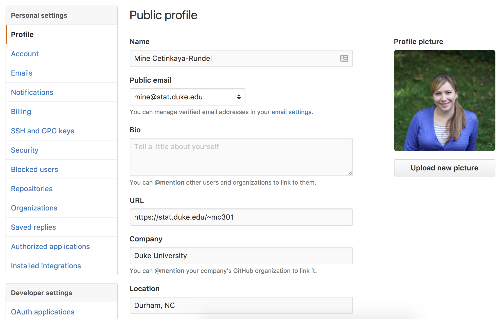

```{r setup, echo=FALSE}
knitr::opts_chunk$set(echo = TRUE)
```

# Welcome to R-Ladies RTP!

## Materials

- All source code at https://github.com/rladies/rtp_20170209_rgitgithub

- Slides at http://rpubs.com/mine/rladies-git


# Git Background

## Why version control? {.smaller}

<div class="centered" style="margin-top: -1em;">

</div>

## Why version control?

- Simple formal system for tracking all changes to a project

- Time machine for your projects
    - Track blame and/or praise
    - Remove the fear of breaking things

- Learning curve is steep, but when you need it you *REALLY* need it

<br/>
<br/>

<div class="centering">
<blockquote>
Your closest collaborator is you six months ago, but you don't reply to emails.
</blockquote>
<cite>-- Paul Wilson, UW-Madison</cite>
</div>

## Why git?

- Distributed
    - Work online or offline
    - Collaborate with large groups

- Popular and Successful
    - Active development
    - Shiny new tools and ecosystems
    - Fast

- Tracks any type of file
    - Works best with text 

- Branching
    - Smarter merges

# Git Demo

## GitHub account

https://github.com/

Username tips:

- Incorporate actual name
- Reuse your username from other contexts, e.g., Twitter or Slack
- Be as unique as possible in as few characters as possible -- useful for GitHub auto-complete
- Make it timeless. Don’t highlight your current university, employer, or place of residence.
- Avoid words laden with special meaning in programming

## Public vs. private repos

- Public repos are free
- Free private repos for users and organizations in education, academic research, nonprofits, and charities
    - Otherwise private repos for $
  
## R and RStudio

Stay current!

- R v3.3.2: https://cran.r-project.org/
    - `sessionInfo()` to check your R version
- RStudio v1.0.136: https://www.rstudio.com/products/rstudio/download/preview/
    - Help -> About RStudio to check your RStudio version

## The shell

- In RStudio, Tools -> Shell

- This will take you to the shell in your current directory

## Checkpoint #1: Is Git already installed?

Go to the shell. Enter `which git` to request the path to your Git executable:

```{bash}
which git
```

and `git --version` to see its version:

```{bash}
git --version
```

**IF NOT:** See http://happygitwithr.com/install-git.html or follow along with someone near you who has git installed.

## Introduce yourself to Git {.smaller}

We want to let `git` know who we are so there are some simple configuration options we should setup.

Let's first tell `git` who we are, and what editor we want to use.

```bash
$ git config --global user.name "Mine Cetinkaya-Rundel"
$ git config --global user.email "mine@stat.duke.edu"
$ git config --global core.editor nano
$ git config --global --list
```

- If using multiple machines, do this on every machine.
- `user.name` does NOT have to be your GitHub username, although it can be. Another good option is your actual first name and last name. Your commits will be labelled with this name, so this should be informative to potential collaborators.
- `user.email` must be the email that you used to sign up for GitHub.

## Some initial configuration

Make sure to put this information in your github profile as well.



## Git clients

- RStudio - very basic (we'll demo today)
- SourceTree - https://www.sourcetreeapp.com/ (Mac + Windows)
- GitKraken - https://www.gitkraken.com/ (Mac + Windows + Linux)

# Connect to GitHub

## Make a new repo

- Go to https://github.com and make sure you are logged in.

- Click green "New repository" button. Or, if you are on your own profile page, click on "Repositories", then click the green “New” button.

- Repository name: `myfirstrepo` (or whatever you wish, we will delete this)

- Public

- YES Initialize this repository with a README

- Click big green button "Create repository"

- Copy the HTTPS clone URL to your clipboard via the green "Clone or Download" button

## Clone the repo

In RStudio

- File -> New Project...

- Version Control
    - If you don't see this option, see http://happygitwithr.com/rstudio-see-git.html#do-you-have-a-problem

- Git

- Fill in Repository URL, project name (what you want the folder to be called locally), browse to where you want this folder to live

## Making local changes, save, and commit

- Edit the `README.md` file in RStudio
    - Remove something from an existing line
    - Add something to a new line

- Go to the Git tab and view the Diff

- Check box next to README.md to Stage: Makes git aware of the current version of both files, but we have not actually saved the changes yet.

- Enter commit message
    - Concise, but informative is best
    - Ok if it's obvious, it will be easier to browse commit messages than diffs later
  
- Hit Commit to save the changes (locally)

  
## Push your changes to GitHub and view
  
- And finally Push
    - You might be prompted for your GitHub username and password

- Go to your GitHub repo and view your commit history

## What's with the yellow question marks?

- These files got created when you created the R project

- `.gitignore` lists files that won't be tracked by git

- `*.Rproj` is the R project information

**EXERCISE:**

- Stage, commit, push both

- Review your commit on GitHub

## Already tired of entering your username and password?

- Option 1: Temporarily store password in memory
https://git-scm.com/docs/git-credential-cache
    - Before you push run `git config credential.helper cache` in shell
    - This will cache credentials for 15 minutes (900 seconds) by default
    - `git config credential.helper 'cache --timeout=300'` reduces caching to 5 minutes
  
- Option 2: Credential caching for HTTPS access
http://happygitwithr.com/credential-caching.html#credential-caching

- Option 3: Set up SSH keys
http://happygitwithr.com/ssh-keys.html#ssh-keys


## EXERCISE: Add a new file

- Create a new R Markdown file (just the example template will do)

- Knit HTML

- Stage, commit, push, review commit on GitHub

- Want to see your results/graphs on GitHub? Use `output: github_document` instead.

## Making the problem worse {.smaller}

What if at the same time a collaborator was making changes to the same file?

**On GitHub:**

- Edit README.md
- Commit, with a message

**In RStudio:**

- Edit README.md again, changing something else on the same line
- Stage, commit, push


## Merging remote changes

- Before you can push, you'll need to pull

- And then resolve the merge conflict

- Finally you can push

## Git commands -> RStudio actions

- Stage -> `git add`

- Commit -> `git commit`

- Push -> `git push`

- Pull -> `git pull`

# Acknowledgments

## Acknowledgments
Above materials are derived in part from the following sources:

- Jenny Bryan - [Happy Git with R](http://happygitwithr.com/)
- Karl Broman - [Wisc's Tools4RR](http://kbroman.org/Tools4RR/)
- [Software Carpentry Project](http://software-carpentry.org/)