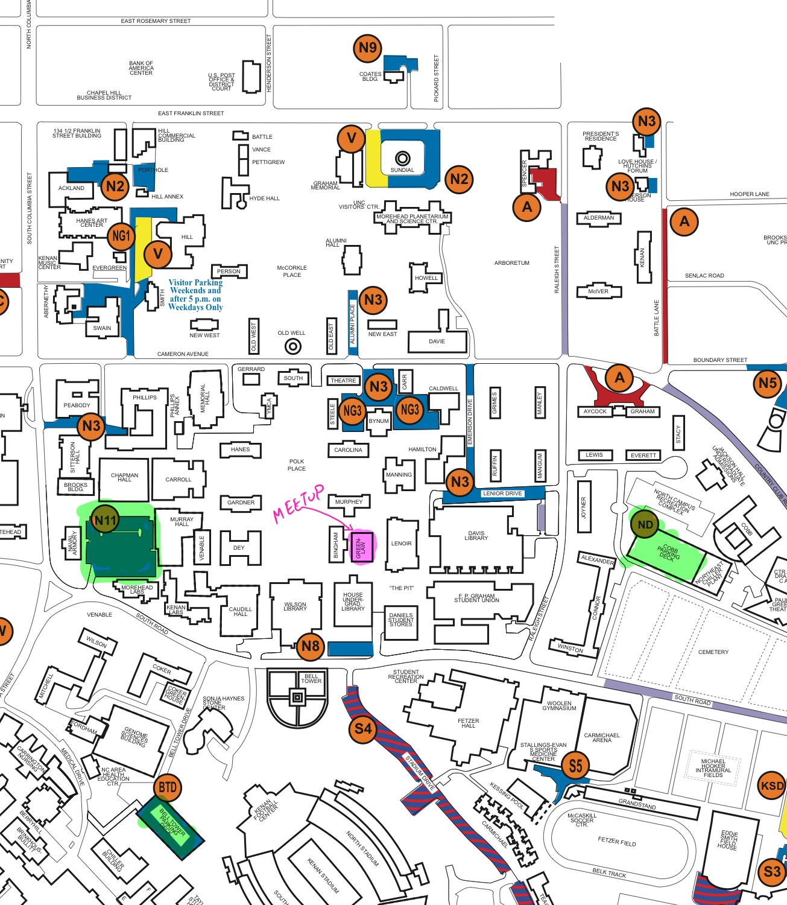

## Parking map

- Pink highlighted: Greenlaw. The classroom is on the ground floor. 

- Green highlighted: Three suggested decks for parking. Most decks open up at 5pm but we suggest trying these first:
  - N11
  - Cobb parking deck (ND)
  - Bell tower parking deck (BTD)

There are no events (especially sporting events) on Thursday so hopefully we should be ok parking-wise but one can never tell with universities. As always the paid parking on Franklin/Rosemary typically is available and a 10 min walk to Greenlaw.